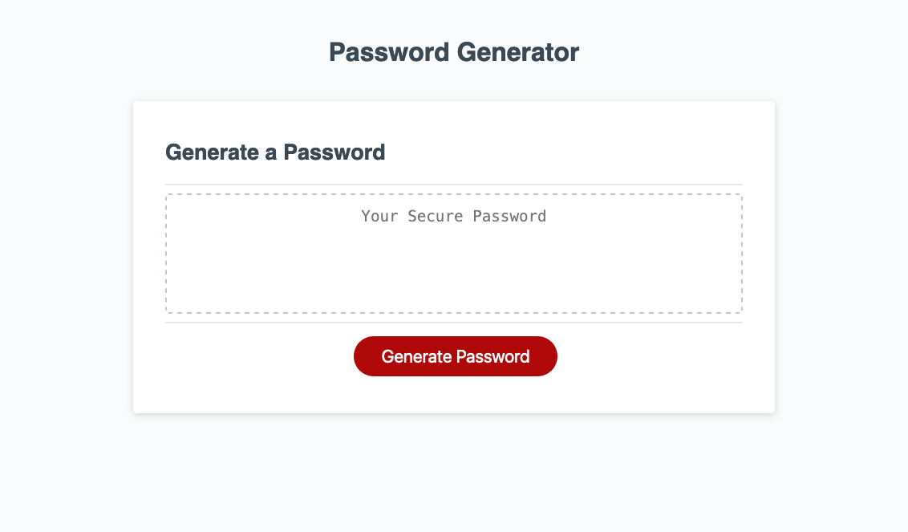

# challenge-03
Password generator website. It allows you to define the criteria for creating a password such as allowing lower case letters, numerics, and special characters. It is also robust so that it doesn't throw errors for when the user does an unintended action such as canceling mid-prompt.

# What I Learned
* I learned how to use functions which are basically reusable pieces of code. Really good way to avoid repeating code.
* Using try-catch for handling errors gracefully.
* Using objects to orginize data. For this case, storing the criteria needed for generating a password.

Try it out here: [https://elmfer.github.io/challenge-03/](https://elmfer.github.io/challenge-03/)

### Screenshot

### Credits
* Starter code forked from: [https://github.com/coding-boot-camp/friendly-parakeet](https://github.com/coding-boot-camp/friendly-parakeet)
* Special character list from : [https://owasp.org/www-community/password-special-characters](https://owasp.org/www-community/password-special-characters)